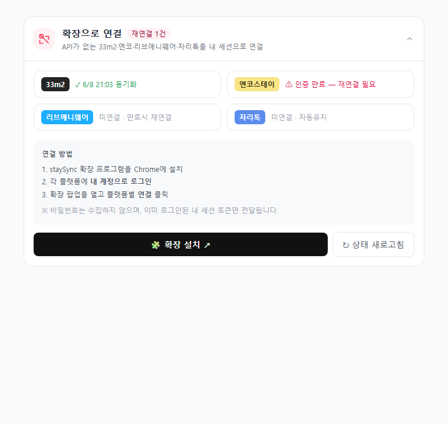
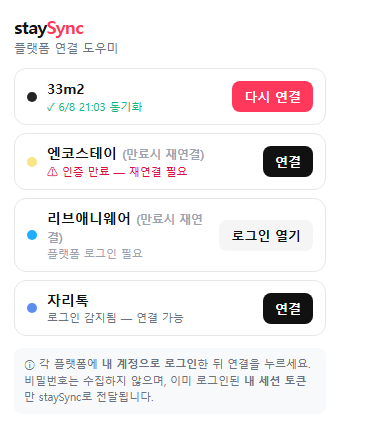

# staySync 확장 프로그램 설치 가이드

> 33m2(삼삼엠투)·엔코스테이·리브애니웨어처럼 **자동 연동(iCal)이 안 되는 플랫폼**을
> staySync에 연결하려면 Chrome 확장 프로그램이 필요합니다.
> 이 가이드를 따라 **5분이면** 설치·연결이 끝납니다.

---

## 시작하기 전에 (준비물)

| 준비물 | 설명 |
|--------|------|
| 💻 **PC** | 확장은 PC Chrome 전용입니다 (휴대폰·태블릿 불가) |
| 🌐 **Chrome 브라우저** | 없으면 [google.com/chrome](https://www.google.com/chrome/) 에서 설치 |
| 👤 **플랫폼 호스트 계정** | 연결할 플랫폼(33m2 등)에 로그인할 수 있는 본인 계정 |
| ✅ **staySync 가입** | staySync에 먼저 회원가입·로그인되어 있어야 합니다 |

> 🔒 **안심하세요.** 확장은 비밀번호를 저장하거나 전송하지 않습니다.
> 이미 로그인된 **내 화면의 예약 정보만** 읽어 staySync로 가져옵니다.

---

## 설치 방법

### 방법 ① 일반 설치 (Chrome 웹스토어) — 권장

1. staySync 대시보드 → **방 관리** 메뉴로 이동
2. 상단 **"확장으로 연결"** 카드에서 **`확장 설치`** 버튼 클릭

3. 열린 **Chrome 웹스토어** 페이지에서 **`Chrome에 추가`** 클릭
4. 팝업이 뜨면 **`확장 프로그램 추가`** 클릭
5. 주소창 오른쪽에 staySync 아이콘(🧩)이 생기면 완료 ✅

> 💡 아이콘이 안 보이면 주소창 오른쪽 **퍼즐(🧩)** 아이콘을 누르고
> staySync 옆 **압정(📌)** 을 눌러 고정하세요.

---

### 방법 ② 직접 설치 (베타 테스트용)

> 아직 웹스토어 정식 출시 전이거나, 베타 파일을 받으신 경우입니다.

1. staySync에서 받은 **확장 폴더(또는 .zip 압축해제)** 를 PC에 저장
2. Chrome 주소창에 입력 → **`chrome://extensions`** → Enter
3. 화면 **오른쪽 위 `개발자 모드`** 스위치를 **켜기**
4. **왼쪽 위 `압축해제된 확장 프로그램을 로드`** 클릭
5. 저장한 **확장 폴더**를 선택
6. 목록에 **"staySync 연결 도우미"** 가 나타나면 완료 ✅

---

## 플랫폼 연결하기 (설치 후)

1. 연결할 플랫폼(예: **33m2**)에 **내 계정으로 직접 로그인** 해둡니다
   - 예: `web.33m2.co.kr` 접속 → 평소처럼 로그인
2. 주소창의 **staySync 아이콘(🧩)** 클릭 → 팝업 열기
3. 연결하려는 플랫폼 옆 **`연결`** 버튼 클릭
4. "연결 완료" 메시지가 뜨면, staySync 캘린더에 예약이 자동으로 들어옵니다 🎉

| 플랫폼 | 연결 유지 |
|--------|-----------|
| 33m2 · 자리톡 | 자동 유지 (다시 로그인 거의 불필요) |
| 엔코스테이 · 리브애니웨어 | 만료 시 확장에서 **다시 연결** 한 번 필요 |

---

## 자주 묻는 질문 (FAQ)

**Q. 제 비밀번호가 staySync로 넘어가나요?**
아니요. 확장은 비밀번호를 절대 읽거나 저장하지 않습니다. 이미 로그인된
**내 브라우저 세션의 예약 정보만** 가져옵니다.

**Q. 휴대폰에서도 설치되나요?**
아니요. Chrome 확장은 **PC 전용**입니다. PC에서 한 번 연결하면, 이후
예약 동기화는 staySync 서버가 자동으로 처리하므로 휴대폰 앱/웹에서도
결과를 볼 수 있습니다.

**Q. "재연결 필요"라고 떠요.**
플랫폼 로그인 세션이 만료된 것입니다. 해당 플랫폼에 다시 로그인한 뒤,
확장 팝업에서 **`다시 연결`** 을 눌러주세요.

**Q. 연결했는데 예약이 안 보여요.**
① 해당 플랫폼의 **예약 목록/캘린더 화면**을 한 번 열어주세요.
② staySync에도 로그인되어 있는지 확인하세요.
③ 그래도 안 되면 고객센터로 문의해주세요.

**Q. 확장을 삭제하면 어떻게 되나요?**
이미 가져온 예약은 staySync에 남아있습니다. 다만 새 예약 자동 수집은
멈추므로, 계속 쓰시려면 확장을 유지해주세요.

---

## 도움이 필요하면

- 📧 고객센터: support@staysync.kr *(예시)*
- 💬 대시보드 우측 하단 채팅

---

*본 가이드는 staySync 고객용 안내 문서입니다. 화면은 업데이트에 따라
조금씩 다를 수 있습니다.*
